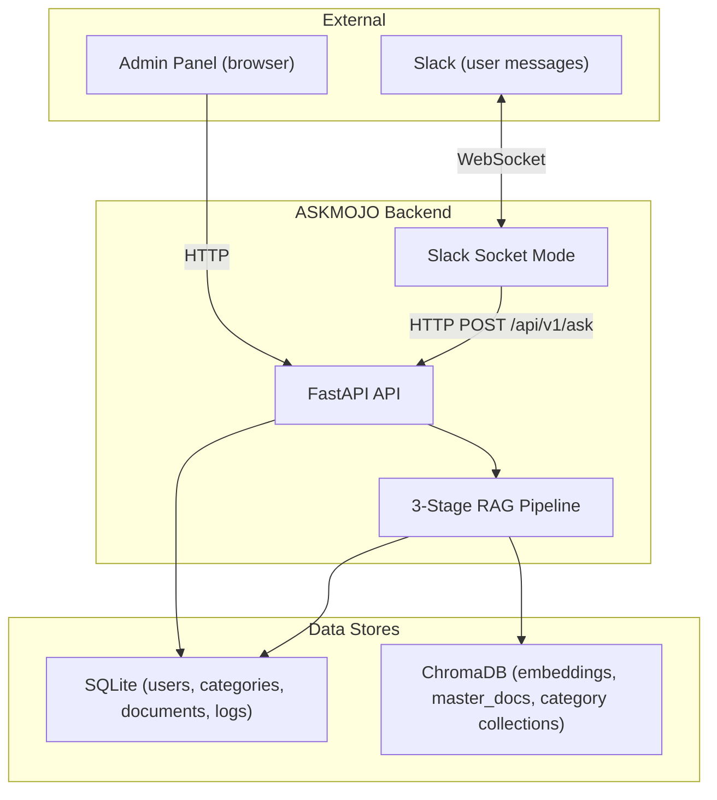
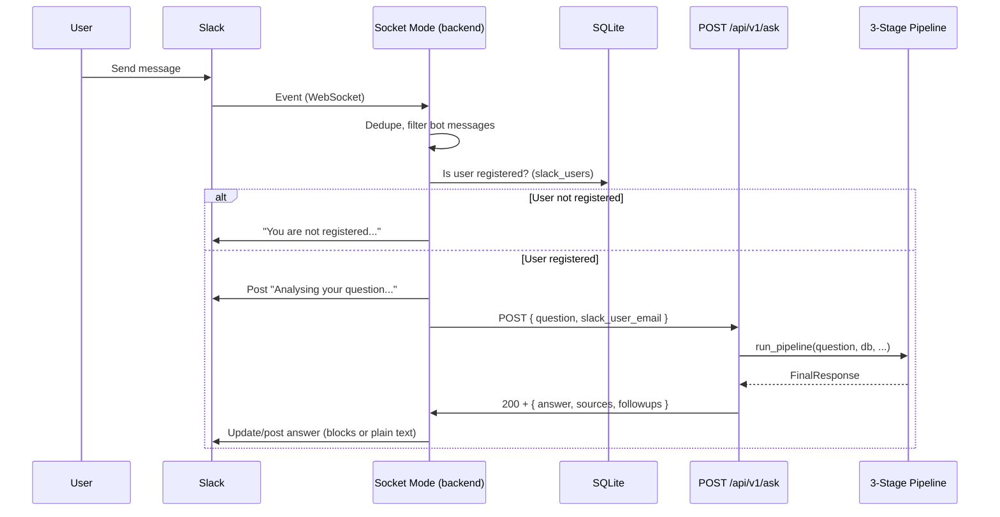
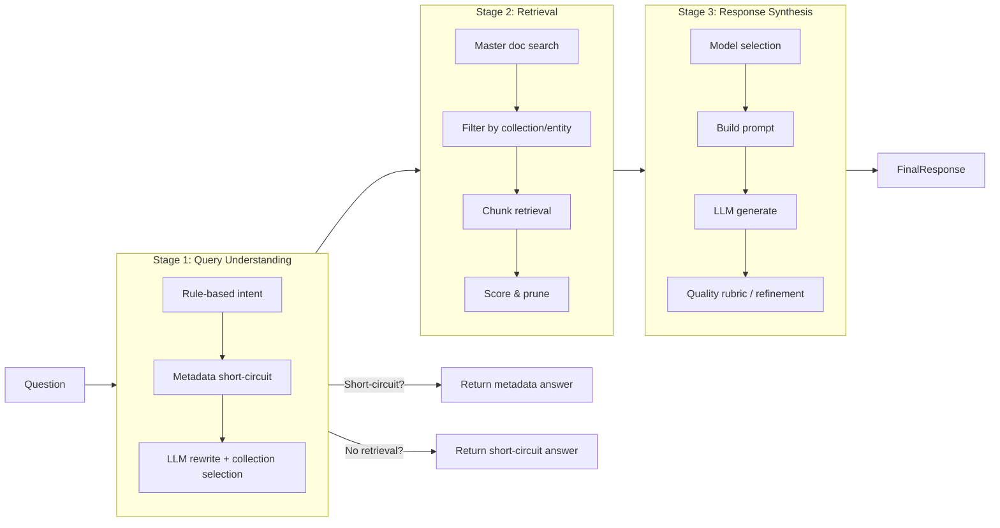
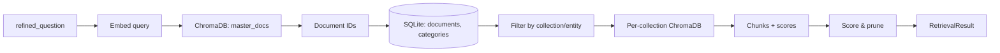
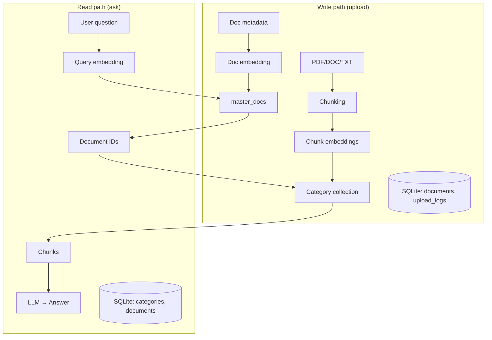
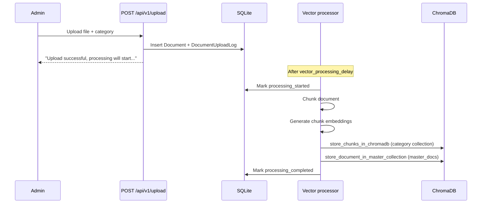

# ASKMOJO-Slack Workflow & Data Flow

This document describes the end-to-end workflow of the ASKMOJO Slack application, including data flow and flow diagrams.

---

## 1. System Overview

ASKMOJO is a RAG (Retrieval-Augmented Generation) backend that answers user questions using uploaded documents. Users interact via **Slack** (Socket Mode). Admins manage users, categories, and documents via the **Admin Panel** (web UI). The answer pipeline is a **3-stage RAG** flow: Query Understanding → Retrieval → Response Synthesis.

---

## 2. Slack Message → Answer Flow

When a user sends a message in Slack (DM or channel), the following steps run.

**Steps in code (high level):**

| Step | Location | Description |
|------|----------|-------------|
| 1 | `socket_mode.py` | Receive event; extract `user_id`, `text`; strip bot mentions. |
| 2 | `socket_mode.py` | Check `slack_users` in SQLite; if not found, reply "not registered" and return. |
| 3 | Optional | Fetch user email from Slack API; update DB. |
| 4 | `socket_mode.py` | Post loading message ("Analysing your question..."), then `httpx.post(base_url + "/api/v1/ask", json={ question, slack_user_email })`. |
| 5 | `ask.py` | Validate `AskRequest`, call `run_pipeline()`, convert to `AskResponse`, return JSON. |
| 6 | `socket_mode.py` | On success: update loading message or post new message with answer. On HTTP error: show "Sorry, I encountered an error (HTTP 500)..." or similar. |

**Important:** `base_url` is `http://127.0.0.1:{settings.port}`. If you run uvicorn with `--port 8001`, set `PORT=8001` in `.env` so Socket Mode calls the correct server.

---

## 3. Three-Stage RAG Pipeline (Data Flow)

The core logic lives in `app/pipeline/orchestrator.py`. A single question flows through three stages; some paths short-circuit and skip retrieval or synthesis.

### Stage 1: Query Understanding

| Step | Module | Data in → out |
|------|--------|----------------|
| 1a | `intent.py` → `intent_router` | `raw_question` → `IntentDecision` (intent, attribute, entity, hints). |
| 1b | `metadata_handler.py` | Intent + question + DB → optional `FinalResponse` (e.g. count, list, greeting, objection). If set, pipeline returns immediately. |
| 1c | `query_rewrite.py` | FACTUAL only: LLM rewrite + collection selection → `refined_question`, `selected_collections`, `proceed_to_retrieval`, optional `short_circuit_answer`. |

If `proceed_to_retrieval` is false, the pipeline returns the short-circuit answer (or a fallback) and does not run Stage 2 or 3.

### Stage 2: Retrieval

| Step | Module | Data in → out |
|------|--------|----------------|
| 1 | `retrieval.py` | `refined_question` → ChromaDB **master_docs** (embed query, similarity search) → list of document IDs. |
| 2 | `retrieval.py` | Document IDs + SQLite (documents, categories) → filter by selected collections, entity, doc type. |
| 3 | `retrieval.py` | Per collection: ChromaDB **category collections** → retrieve chunks (parallel). |
| 4 | `chunk_scorer.py` | Chunks → score, token budget, data quality assessment → `RetrievalResult` (documents + chunks). |

**Data flow in Stage 2:**

### Stage 3: Response Synthesis

| Step | Module | Data in → out |
|------|--------|----------------|
| 1 | `model_selector.py` | answer_mode, data quality, question complexity, etc. → model name, max_tokens, temperature. |
| 2 | `response_generator.py` | Context + prompts (role, response type) → system + user prompt. |
| 3 | `response_generator.py` | Prompt + chunks (optionally TOON-encoded) → OpenAI chat completion → raw answer. |
| 4 | `response_generator.py` | Quality rubric; optional refinement pass. |
| 5 | `response_generator.py` | Build follow-ups, sources, token usage → `FinalResponse`. |

---

## 4. Data Stores & Data Flow

### SQLite (`app/sqlite/`)

| Table / concept | Purpose |
|-----------------|---------|
| `users` | Admin and Slack users (email, password hash, role). |
| `slack_users` | Slack user ID ↔ email; used to check “is this Slack user allowed to ask?”. |
| `slack_integrations` | Workspace config: app token, bot token, Socket Mode enabled, etc. |
| `categories` | Category name, collection_name, description, domains. |
| `documents` | Document metadata: title, file path, category, description, uploader. |
| `query_logs` | Logged questions and answers (for admin panel). |
| `document_upload_logs` | Per-upload log (processing status, errors, timing). |

### ChromaDB (`app/vector_logic/vector_store.py`)

| Collection | Content |
|------------|---------|
| **master_docs** | One embedding per document (e.g. title + description). Used in Stage 2 to get candidate document IDs from the user query. |
| **Per-category collections** | Chunks of documents in that category; each chunk has an embedding. Used in Stage 2 to retrieve relevant chunks for the selected collections. |

### Embeddings

- **Model:** SentenceTransformer `all-MiniLM-L6-v2` (in `vector_store.py`: `_embed_query`, `embed_worker`).
- **Usage:** Query embedding for master_docs and per-collection search; chunk embeddings created at document upload/processing time.

---

## 5. Document Upload Flow

Admins upload documents via the Admin Panel (or API). The backend stores the file, creates a DB row and upload log, and (after an optional delay) a background processor chunks the document, generates embeddings, and writes to ChromaDB.

**Relevant code:**

- Upload endpoint: `app/vector_logic/routes.py` (`/upload`).
- Processing: `app/vector_logic/processor.py` (chunking, `store_chunks_in_chromadb`, `store_document_in_master_collection`).
- ChromaDB helpers: `app/vector_logic/vector_store.py`.

---

## 6. API & Application Entry Points

### Startup (`app/main.py`)

1. Init SQLite (connection, migrations, create tables).
2. Init ChromaDB (`init_chromadb()`).
3. If Slack Socket Mode is configured and enabled in DB, start Socket Mode client (connects to Slack via WebSocket).

### Main routers (prefixes)

| Prefix | Router | Main routes |
|--------|--------|-------------|
| `/api/v1`, `/api/v2` | `new_ask_router` | `POST /ask` (3-stage pipeline). |
| `/api` | `health_router` | `GET /health`. |
| `/api/v1` | `auth_router` | Login, JWT. |
| `/api/v1` | `user_router` | User API. |
| `/api/v1` | `vector_router` | Document upload, list, delete, search. |
| `/api/v1` | `admin_router` | Stats, users, categories, Slack config, upload logs, etc. |
| `/api/v1` | `slack_router` | Slack config (and any other Slack HTTP endpoints). |

Static files (e.g. Admin Panel) are served under `/static`. Root `/` redirects to `/static/index.html`.

---

## 7. Configuration Notes

- **PORT**  
  Socket Mode calls `http://127.0.0.1:{settings.port}/api/v1/ask`. Set `PORT` in `.env` to match the port you run uvicorn on (e.g. `8001`).

- **OpenAI**  
  Stage 1 (query rewrite) and Stage 3 (answer generation) need `OPENAI_API_KEY` in `.env`. If missing, the ask endpoint can return 500.

- **ChromaDB**  
  Optional `CHROMADB_PERSIST_DIRECTORY` in `.env`. Default is `app/vector_db/chroma_db`.

- **Slack**  
  Slack app token and bot token (and optional signing secret, etc.) are stored in `slack_integrations` and used by Socket Mode and Slack routes.

---

## 8. Error Handling (Ask Flow)

- **ChromaDB index missing/corrupt:** Caught in `ask.py` as `ChromaDBIndexUnavailableError`; returns 200 with a friendly message (no 500).
- **Any other exception in `run_pipeline`:** Logged with `[ASK] Error: ...` and full traceback; API returns **500**. Slack Socket Mode then shows “Sorry, I encountered an error (HTTP 500). Please try again.”
- **Connection failure from Socket Mode to `/ask`:** “All connection attempts failed” (e.g. wrong port or server not reachable). Fix by aligning `PORT` and the uvicorn port.

This workflow document and the diagrams reflect the current codebase and data flow for ASKMOJO-Slack.
